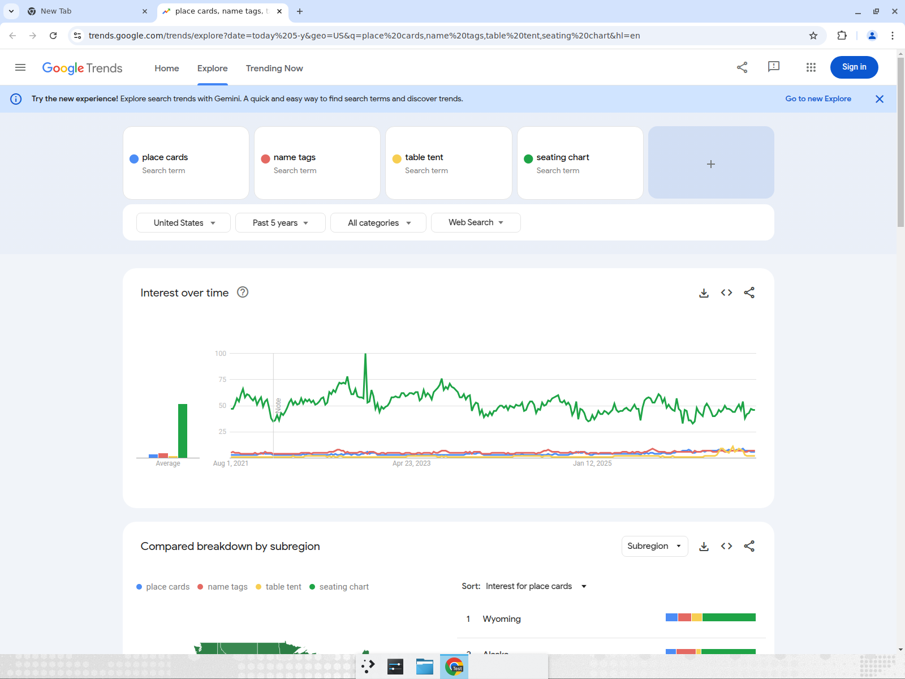
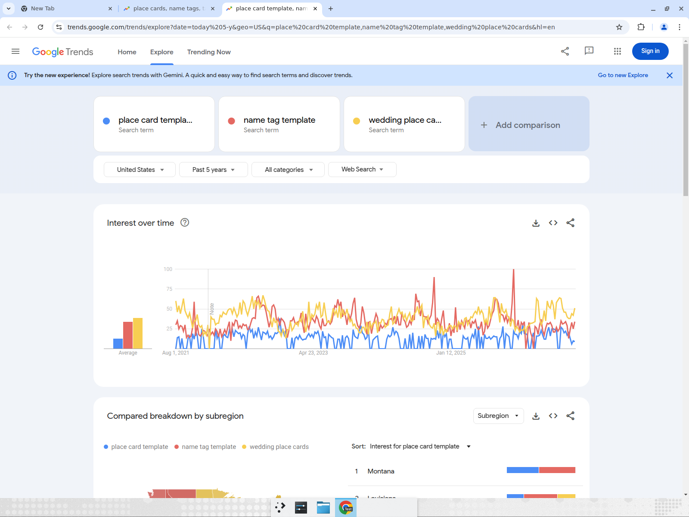
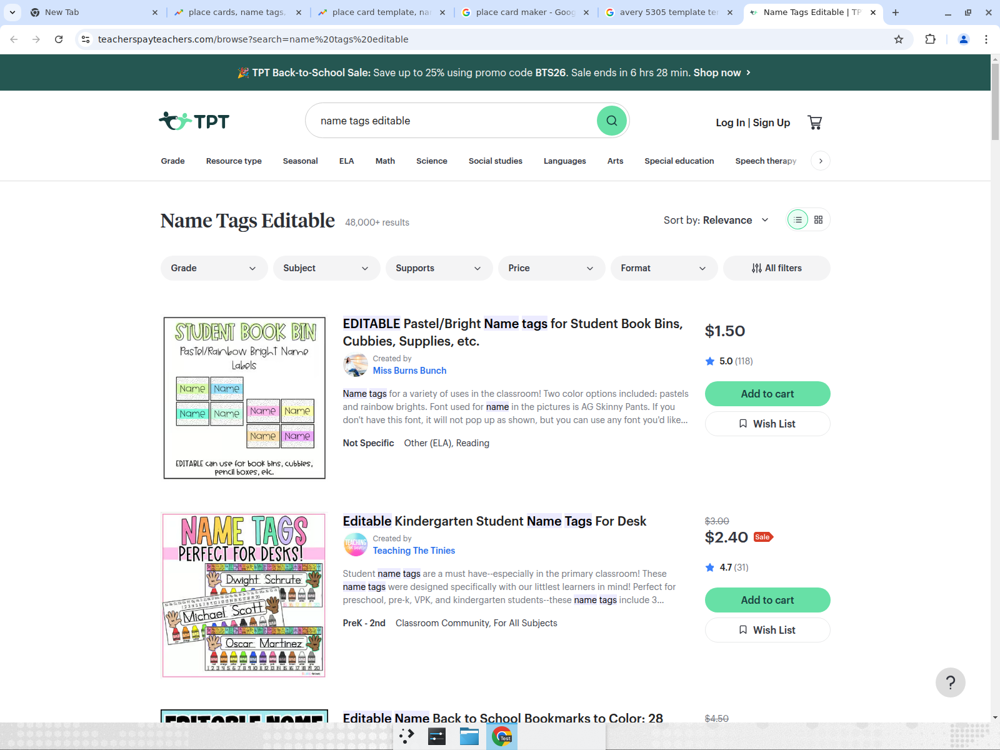
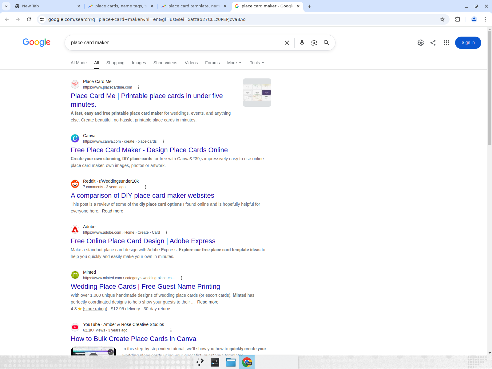
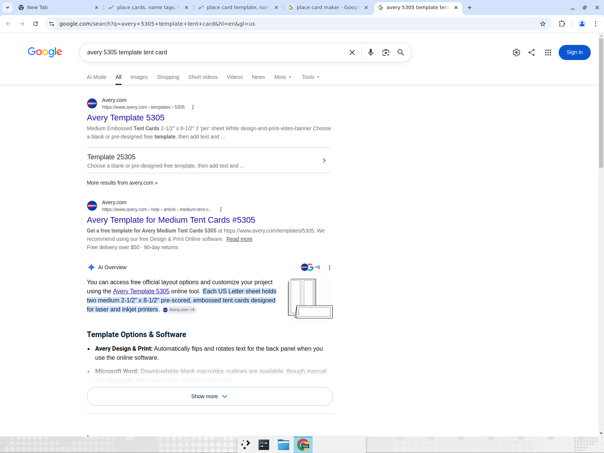

# SeatMark 海外市场调研与英文版可行性方案

- 调研日期：2026-08-05（所有截图均为当日实际检索，Google 地区 US / 语言 EN）
- 角色：市场研究员 + 产品策略
- 结论先行：**谨慎 GO —— 低成本试水**。英语市场确有真实、持续、季节性强的同品类需求（婚礼 place cards、教师 name tags、会议 name tents），且已有独立开发者靠单一 place card 工具做出可验证收入；但「place card maker」这类工具词本身搜索量小，流量大头在品类词/模板词的 SEO 长尾，冷启动依赖内容与程序化 SEO。我们的「零上传隐私 + 毫米级校准 + Excel 批量」组合在英语市场是**部分稀缺**卖点（本地处理开始被 2024-2026 年的新进小玩家采用，但巨头均为云端处理），窗口仍在。

---

## 1. 需求验证：英语市场有没有这种需求？

### 1.1 Google Trends（美国，近 5 年）

**品类词对比：place cards / name tags / table tent / seating chart**

- `seating chart`（绿色）常年热度最高（指数 40-60），且每年 8-9 月出现开学季峰值——但注意该词大部分意图指向「教室座位表/婚礼座位总表」工具，与我们的「座位标签」是相邻品类。
- `place cards`、`name tags`、`table tent` 三个词常年有稳定的低位基线（指数 3-8），无衰减趋势——小而稳的常青需求。

**制作意图词对比：place card template / name tag template / wedding place cards**

- `name tag template`（红色）每年 8-9 月（back to school）出现尖峰（多次打到 75-100），教师开学季是明确的年度需求脉冲。
- `wedding place cards`（黄色）呈春夏婚礼季 + 年末假日双峰形态，全年基线 25-50。
- `place card template`（蓝色）稳定在 25 上下。
- 三个「制作/模板」意图词的量级彼此接近，说明需求分散在多个场景词上，**没有一个统一的大词**，SEO 需要多词矩阵覆盖。

### 1.2 关键词量级（第三方实证数据）

Place Card Me 创始人 Cory Zue 公开的 Google Keyword Planner 数据（[The Place Card Teardown](https://www.coryzue.com/writing/placecard-teardown/)）：

| 关键词 | 月均搜索量 |
|---|---|
| place cards | 10k–100k |
| wedding place cards | 1k–10k |
| printable place cards | 1k–10k |
| place card maker / generator | 仅 10–100 |

启示：**普通用户不搜「maker/generator」工具词，搜品类词和模板词**。冷启动流量必须从 `printable place cards`、`avery 5302 template`、`name tent template` 这类词切入，而不是指望「place card maker」。该数据为 2017 年，量级偏保守；上文 Trends 显示这些词至今热度未衰减。

其后续经营复盘（[Road to Passive Income Part 3](https://www.coryzue.com/writing/road-to-passive-income-part-3/)）证实：place cards 是**强季节性生意**（11-12 月假日 + 4-10 月婚礼季），单人副业靠 SEO 自然流量把免费+付费模板（单价约 $3.5）做到了可观的被动收入——**需求真实且可变现，但天花板是「小而美」**。

### 1.3 三大场景分别评估

**① 教师 / Back to School（最像我们的国内考场场景）**

- TeachersPayTeachers 搜索 `name tags editable` 返回 **48,000+ 个资源**，站内正在打「Back-to-School Sale」，头部商品（$1.5-$2.4 的可编辑桌面名牌/name tags）有上百条评价：

- 解读：教师愿意为「可编辑名牌模板」付 $1-5，但买到的只是 PPT/PDF 模板，仍要**手动逐个改名**。「上传名单→整班批量生成」正是我们对 TPT 模板的降维打击点。desk name tags、cubby labels、classroom seating chart 是每年 7-9 月的刚性采购。
- 需求判定：**强**（季节脉冲明确、付费意愿已被 TPT 验证、现有方案效率低）。

**② 婚礼 / DIY Wedding（英语市场最大的 place card 场景）**

- Google 首页即有 Reddit r/Weddingsunder10k 的《A comparison of DIY place card maker websites》讨论帖（见 1.4 截图），预算型新娘会主动比较 DIY 工具。
- Minted 上代印 place cards 均价 $1+/张，Etsy 可编辑模板 $3.5-8/套，专业手写 $1+/张——100 桌婚礼 DIY 自打印可省 $100-500，省钱动机真实（placecard.net 的获客内容直接以「Save $500+」为标题）。
- Avery 5302（tent card 专用纸）在各工具的导出预设中被反复引用，说明「按 Avery 纸打印」是英语市场的标准工作流。
- 需求判定：**强**（全年基线最大、变现路径成熟：付费模板/一次性导出费）。

**③ 会议 / 活动（name tents、badges）**

- `table tent` 搜索基线低但稳定；Avery 5305（medium tent cards）模板页是 Google 首位结果并带 AI Overview（见 1.4），说明会议桌牌打印是常规办公需求。
- 该场景用户多在企业环境，对「名单不上传服务器」最敏感（参会人 PII），是隐私卖点最能打动的人群，但搜索量小、更依赖口碑/内容营销。
- 需求判定：**中**（量小但客单价潜力与隐私卖点契合度最高）。

### 1.4 检索证据（SERP 实拍）

**Google `place card maker`（US）首页：**

首页构成：Place Card Me（独立开发者）、Canva、Reddit 讨论帖、Adobe Express、Minted（代印电商）、YouTube「How to Bulk Create Place Cards in Canva」教程（6.2 万播放）、购物卡片（Zazzle/Etsy/JAM Paper 模板 $1-$48）。「People also search for」全是 *free printable / template Word / PDF* 类长尾——免费+可打印是核心用户预期。

**Google `avery 5305 template tent card` 首页：**

Avery 官方模板页 + 帮助文章垄断首屏，AI Overview 直接引用 Avery 尺寸规格（2-1/2" × 8-1/2"、每页 2 张）。**Avery 产品编号本身就是一个巨大的模板检索入口体系**（5305/5302/5160/8395…），第三方工具（如 planning.wedding、Place Card Me）都在蹭「Avery codes preset」做兼容预设——我们做英文版必须支持 Avery 编号预设，这也是低竞争长尾（`avery 5302 generator from excel` 类）的切入点。

**社区热度（Reddit / Pinterest / TPT）：**

- Reddit：r/Weddingsunder10k 有专门的 DIY place card 工具对比帖（Google 首页收录）；r/Teachers、r/weddingplanning 常年有 name tags / place cards 的 DIY 讨论（Reddit 对未登录抓取有拦截，正文未截图，SERP 收录见上图）。
- Pinterest：`wedding place cards`、`classroom name tags` 是 Pinterest 的经典 DIY 品类（Avery 官方在 Pinterest 开设账号运营该品类），视觉灵感流量大，适合模板图片被动分发。
- TPT：48,000+ 可编辑 name tag 资源（见 1.3 截图），教师付费习惯成熟。

---

## 2. 竞品格局

### 2.1 主要玩家对比

| 竞品 | 免费/付费线 | 与我们的差异 | SEO 强度 |
|---|---|---|---|
| **Avery Design & Print**（[官网](https://www.avery.com/software/design-and-print/)） | 完全免费（靠卖标签纸盈利） | 云端处理需上传名单；绑定 Avery 纸品编号体系；支持 Excel/CSV mail merge；无毫米级自定义画布 | 极强：垄断所有 Avery 编号词 + label 大词首页 |
| **Canva**（place card maker 落地页） | 免费为主，Pro 订阅解锁素材 | 通用设计工具，bulk create 需借助第三方教程/Apps 且步骤繁琐（YouTube 教程 6.2 万播放证明痛点）；像素单位非 mm；数据上云 | 极强：`place card maker` 等 create 词首页常客 |
| **Adobe Express**（[place card 页](https://www.adobe.com/express/create/card/place)） | 免费 + Premium 品牌功能 | 模板导向、单张设计思维，无名单批量合并；数据上云 | 强：create 类词首页 |
| **OnlineLabels Maestro**（[官网](https://www.onlinelabels.com/maestro-label-designer)） | 买纸送激活码；试用带水印 | 支持 mail merge；深度绑定自家纸品，免费线实际是「买纸解锁」 | 中强：label 词系 |
| **Place Card Me**（placecardme.com） | 空白卡免费；付费模板约 $3.5/次 | 独立开发者产品：Excel 导入、自动排版、Avery/Gartner 纸预设——**功能形态与我们最接近**，但仅 place card 单品类、设计能力弱 | 中：`place card maker`（10-100 量级词）第一名 + 长尾内容矩阵 |
| **新进小玩家**（placecard.us、placecard.net、stronaweselna、gatsbys.party 等，2024-2026 上线） | 免费 + 增值 | placecard.us 已明确宣传「Excel/CSV 在浏览器本地读取」「100+ 模板」「4-up/6-up A4 PDF」——**本地隐私卖点开始被采用** | 弱-中：靠长尾博客文章（how to print from Google Sheets 等）起量 |
| **教室座位表工具**（classroomseatingchart.com、seatingplan.com、easyclass.ai） | freemium 订阅 | 做的是「座位安排算法 + 教室平面图」，不做打印标签——与我们互补而非直接竞争；`seating chart` 大词被他们占据 | 中 |
| **代印电商**（Minted、Zazzle、Etsy 模板卖家） | $0.26-$1+/张代印；$3.5-8 模板 | 非工具，是我们「免费 DIY 自打印」定位的反衬参照物 | 强（购物意图词） |

### 2.2 SEO 首页格局小结

- 工具词（maker/generator）：Canva/Adobe/Avery + Place Card Me 等 indie 混排——**indie 站能上首页**，证明该词群可打，但词量小。
- 品类大词（place cards、name tags）：被 Avery、Minted、Etsy、Pinterest 等占据，短期不可争。
- Avery 编号词（5305/5302/8395 template）：Avery 官方垄断，但「`avery 5302` + `from excel` / `generator` / `bulk`」组合词竞争弱，是可占的缝隙。
- 长尾 how-to 词（how to print place cards from google sheets / excel）：2024-2026 年的新玩家全靠这类博客文章起量，验证了内容 SEO 冷启动路径可行。

### 2.3 我们的差异化是否稀缺？

| 我们的卖点 | 英语市场现状 | 稀缺度 |
|---|---|---|
| 零上传、浏览器本地处理、可离线 | 巨头（Avery/Canva/Adobe/Maestro）全部云端处理；仅个别 2024+ 新站开始宣传本地处理 | **较稀缺，窗口期内**；且是「client-side privacy tools」叙事的顺风（GDPR 下本地处理 = 无需 DPA，见 §3.4） |
| 毫米级物理单位排版 + 打印校准 | Avery 靠「买我的纸」保证对位；Canva/Express 是像素思维，社区常抱怨打印偏移 | **稀缺**，但需转译为英制语境（inch 显示 + Avery 编号预设），否则用户无感 |
| Excel 整名单批量生成 | Avery/Maestro 有 mail merge 但流程繁琐、需上传；Canva bulk create 是进阶技巧；Place Card Me/placecard.us 已做到 | 中等稀缺（indie 已有），我们优势在 150+ 模板 + 设计器 + 照片核验的完整度 |
| 照片核验（照片按文件名匹配名单） | 英语市场同类工具基本没有（badge 打印 SaaS 有但贵） | **稀缺**，可作为会议/学校 badge 场景的独特钩子 |

---

## 3. 可行性方案

### 3.1 Go / No-Go 建议

**建议：GO（低成本试水档）。**

- 支持 GO：需求真实且常青（§1）；indie 单人产品已验证可变现；我们已有完整产品，增量成本主要是 i18n 与内容，不需要新后端；本地隐私 + 照片核验有差异化；纯静态架构天然全球可部署。
- 风险与克制理由：单词量小、强季节性、SEO 冷启动周期 6-12 个月；Canva/Avery 免费且品牌强，我们只能吃长尾；`seatmark` 品牌词在英语市场为零积累。
- 因此不建议「大举出海」，建议按 §4 的 MVP 用 2-4 周工程量上线英文版，跑 3-6 个月 SEO/Pinterest 数据再决定是否加注。止损条件明确：若 6 个月自然月访客 < 1,000 或核心词无前 20 排名，则降级为维护模式。

### 3.2 i18n 工程量评估（基于当前代码实测）

现状：`app/src` 无任何 i18n 框架；**123 个 .vue/.ts 文件含中文，中文字符出现约 19.1 万处**，其中大头是内容数据（`src/data/` 下 guides×4、templateDetails×4、seo.ts、150+ 模板文案），真正的 UI 字符串占比小。

| 工作项 | 方案 | 工作量 |
|---|---|---|
| i18n 框架 | vue-i18n 11（Composition API 模式，legacy: false，与 TS 严格模式兼容） | 0.5 天接入 |
| 路由 | `/en` 前缀路由（`/en`、`/en/studio`），构建期预渲染需同步扩展 entry-server 路由表；hreflang + `<html lang>` 切换 | 1-2 天 |
| UI 字符串抽取 | Studio 工坊 + 落地页 + 通用组件约估 800-1,500 条 key（需抽取后精确统计） | 3-5 天（抽取）+ 1-2 天（翻译校对） |
| 模板文案 | MVP 只译 15 款内置核心模板名称/描述 + 分类词；150+ 全量模板与 templateDetails 二期再说 | 1 天 |
| 内容页 | guides（约十几万字中文）**不翻译**，英文侧另写 8-12 篇原生英文 SEO 文章（对标 §3.4 关键词），不做中文直译 | 与 SEO 冷启动合并计算 |
| 单位/纸张 | 保持 mm 内核，UI 增加 inch 换算显示；新增 US Letter 纸型与 Avery 5305/5302/5160/8395 预设（labelPapers.ts 扩展） | 2-3 天 |
| 合计 | | **约 2-3 周单人工程量**（不含英文内容写作） |

### 3.3 域名与部署策略

- `seatmark.cn` 出海劣势明确：.cn 对英语用户信任度与记忆度差；Google 对 ccTLD 有地域信号倾向（.cn 会被默认关联中国市场）；部分海外企业网络对 .cn 有访问策略限制。
- 建议：注册 **seatmark.app 或 seatmark.com**（若可得）作为英文站主域，独立域名 + 英文站点（而非 seatmark.cn/en 子路径），SEO 地域信号最干净；中英站互挂 hreflang。
- 部署：EdgeOne Pages 有海外节点可继续使用；若海外访问质量不稳，同一静态产物可零成本双发 Cloudflare Pages（仓库已是纯静态 + edge function 架构，AI 代理函数需对应迁移或在英文站禁用）。
- 品牌名「SeatMark」在英语中自然可读（seat + mark），无需改名；tagline 直接主打「Print-perfect name tags & place cards. Your data never leaves your browser.」

### 3.4 SEO 冷启动路径与合规

**关键词打法（由易到难）：**

1. 第一梯队（低竞争工具长尾）：`place cards from excel`、`name tent generator`、`avery 5302 generator`、`bulk name tags from spreadsheet`、`print name tags from excel free`——indie 站证明可 3-6 个月见排名。
2. 第二梯队（模板长尾 + 程序化页面）：为每个 Avery 编号/纸型/场景生成模板落地页（现有 templates 路由体系可复用），对标 `avery 5305 template`、`wedding place card template free` 的次级变体。
3. 第三梯队（内容）：8-12 篇原生英文 how-to（how to make place cards from a guest list、classroom name tags for back to school 等），复制 placecard.us/planning.wedding 的成功路径。
4. 站外：Pinterest 模板图 pin（DIY wedding / classroom decor 品类）、r/Teachers 与 r/weddingplanning 的真诚工具分享、TPT 免费引流品试验。
5. 季节节奏：7-8 月压教师词（back to school），1-4 月压婚礼词（订婚高峰后的筹备期），11 月压 holiday dinner 词。

**合规（GDPR/CCPA）：**

- 本地处理架构 = 名单/照片不构成向我方的个人数据传输，**无需 DPA、无需数据出境评估，反而是欧盟市场的合规卖点**（同类 client-side 工具已把「No DPA needed / GDPR compliant by architecture」写成营销页）。
- 仍需做：英文 Privacy Policy 与 Terms（现有 /privacy /terms 页翻译重写）；若挂分析脚本需 cookie consent（建议用无 cookie 的 Cloudflare/Plausible 类分析规避 banner）；AI 设计辅助功能会把用户输入发往模型 API，英文版需明示或 MVP 期默认关闭。

---

## 4. MVP 范围与分阶段计划（GO 之后）

### Phase 0（第 1-2 周）：英文 MVP

- vue-i18n 接入 + `/en` 路由 + 预渲染扩展；Studio 全部 UI 字符串英化。
- 落地页英文重写（非直译）：主打 privacy-first + Excel bulk + print-perfect 三卖点。
- US Letter 纸型 + Avery 5305/5302/5160/8395 预设 + inch 显示。
- 15 款核心模板名称/描述英化，优先 place card（tent 折叠）、desk name tag、conference name tent 三类。
- 英文 Privacy/Terms；hreflang；英文站独立域名上线（seatmark.app/.com）。
- 验收：390/768/1280 无横向溢出照旧；`npm run test`、`npm run build` 通过。

### Phase 1（第 3-6 周）：SEO 基建

- 8-12 篇英文 how-to 文章 + Avery 编号程序化模板页。
- Google Search Console / Bing Webmaster 提交；Pinterest 账号 + 首批 30 pin。
- 事件埋点区分 en 流量漏斗（导入→生成→导出转化率）。

### Phase 2（第 2-4 个月）：场景加深与变现试验

- 教师包（开学季）：desk name tags、cubby labels、classroom job charts 模板包。
- 婚礼包：escort/place card 模板 + meal choice 图标。
- 变现 A/B：免费全功能 + 付费高级模板（对标 Place Card Me $3.5 一次性），或保持全免费换增长（遵循「前期免费」原则，接入真实支付前先请示）。

### Phase 3（第 4-6 个月）：复盘决策

- 数据门槛：自然月访客 ≥ 1,000 且任一核心词进前 20 → 加注（全量模板英化、更多语种）；未达 → 维护模式。

---

## 附录：证据清单

| 证据 | 文件/来源 |
|---|---|
| Google Trends 品类词 US 5y | `research-assets/trends-4terms-us-5y.png` |
| Google Trends 模板词 US 5y | `research-assets/trends-template-terms-us-5y.png` |
| Google SERP `place card maker` | `research-assets/serp-place-card-maker.png` |
| Google SERP `avery 5305 template tent card` | `research-assets/serp-avery-5305.png` |
| TPT `name tags editable` 48,000+ 结果 | `research-assets/tpt-name-tags-editable.png` |
| Avery 官方 5305 模板页 | `research-assets/avery-template-5305.png` |
| 关键词量级/收入实证 | coryzue.com「The Place Card Teardown」「Road to Passive Income Part 3」 |
| 竞品页面 | avery.com/software/design-and-print、canva.com/create/place-cards、adobe.com/express/create/card/place、onlinelabels.com/maestro-label-designer、placecardme.com、placecard.us、placecard.net、stronaweselna.com、gatsbys.party |
| 社区 | Reddit r/Weddingsunder10k「A comparison of DIY place card maker websites」（Google 首页收录；Reddit 反爬未能截取正文） |

> 局限性说明：Canva 落地页遭 Cloudflare 人机验证拦截未能截图（文字内容经检索确认）；Reddit 正文遭反爬拦截，仅有 SERP 收录佐证；Cory Zue 的关键词量级数据为 2017 年 Keyword Planner 区间值，用作量级参考而非精确值。
